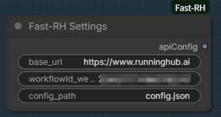
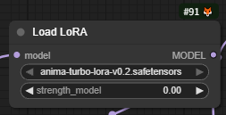
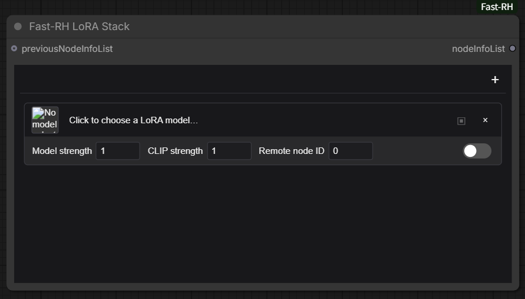
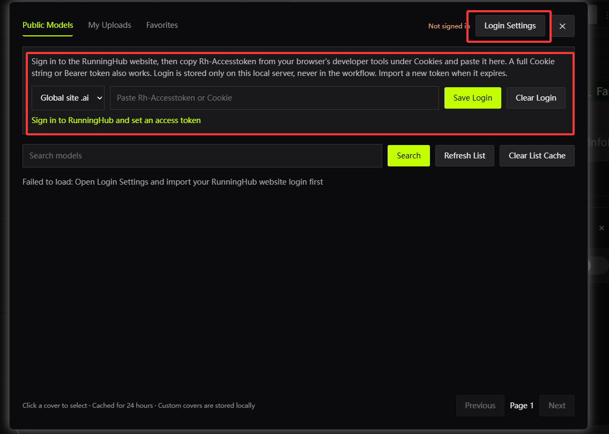
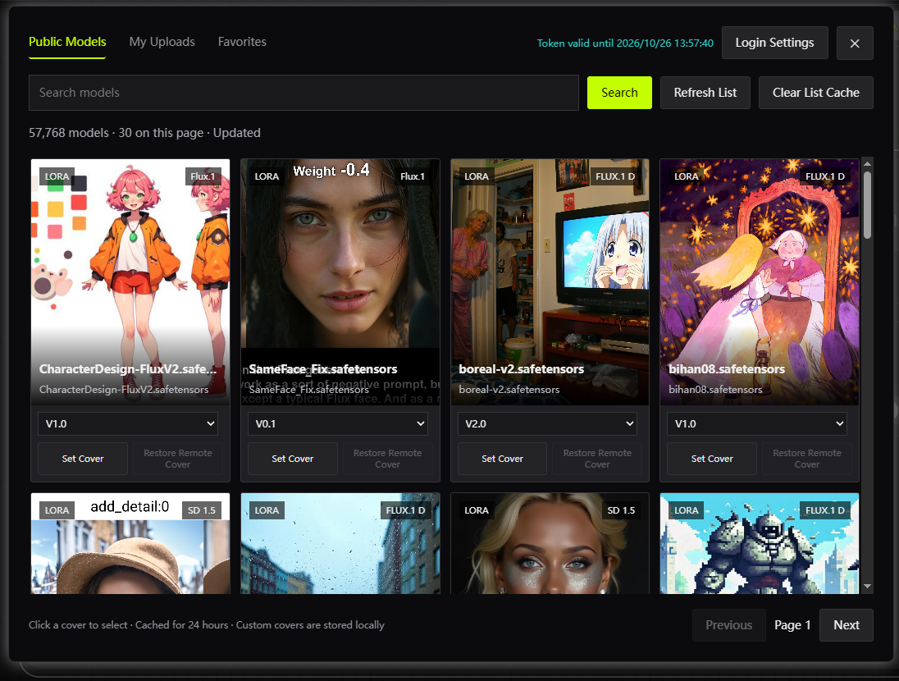
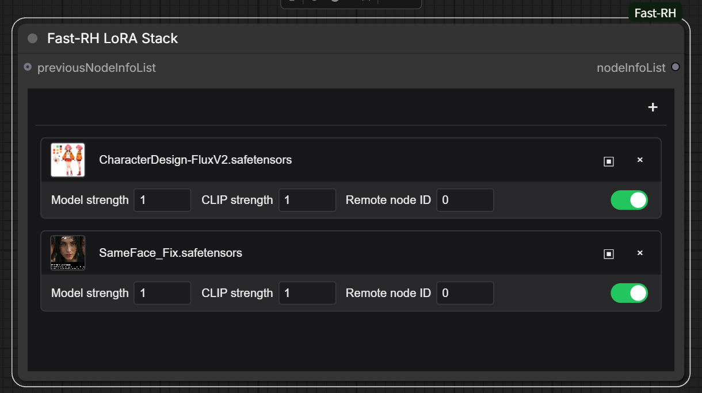
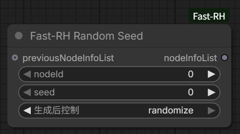
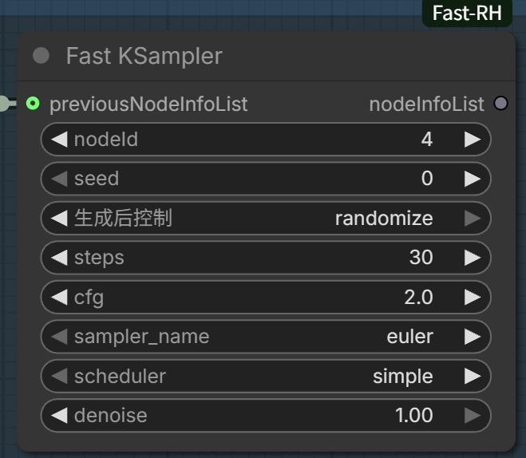
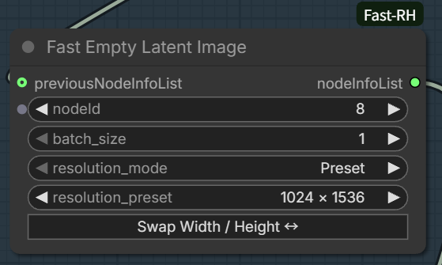

# Fast-RH

[简体中文](README_CN.md) | English

Fast-RH makes it easier to control RunningHub image-generation workflows locally from ComfyUI.

The official [ComfyUI_RH_APICall](https://github.com/HM-RunningHub/ComfyUI_RH_APICall) nodes can be cumbersome to use, so this plugin provides simpler nodes for common tasks.

## Installation

- Place this repository in `ComfyUI/custom_nodes/ComfyUI-Fast-RH`, or install it through ComfyUI Manager using its Git URL.

## Fast-RH Settings

The official **RH Settings** node saves `api_key` as a node parameter. When you share an image containing workflow metadata, that key may be included in the image.

Replace **RH Settings** with **Fast-RH Settings**. The node has `base_url`, `workflowId_webappId`, and `config_path` inputs. Its `apiConfig` (`STRUCT`) output connects to the official RunningHub execution and upload nodes without changing the rest of the workflow.

### Setup



1. Copy `config.example.json` to `config.json` in the **ComfyUI-Fast-RH** plugin directory, then enter your RunningHub API key:

   ```json
   {
     "api_key": "enter_your_api_key_here"
   }
   ```

2. In **Fast-RH Settings**, set `base_url` to the RunningHub site associated with that API key. Enter the remote workflow or Web App ID in `workflowId_webappId`.
3. `config_path` defaults to `config.json` in the plugin directory. For a file elsewhere, enter an absolute path or a path relative to the directory containing `node.py`. Connect `apiConfig` to the execution or upload node that previously received the official **RH Settings** output.

ComfyUI reads the API key from the file when it runs the workflow; the key is not saved in the workflow. After editing `config.json`, queue the workflow again to use the new key.

> **Note:** Replace old **RH Settings** nodes before sharing workflows. Images and workflow files created earlier may still contain the original API key; replacing the node does not remove it from those files.

## Fast-RH LoRA Stack

Create a Load LoRA placeholder in the remote RunningHub workflow first. You can select any model and set `strength_model` to `0`. Then you can switch the remote model from ComfyUI.



### How to use

Add **Fast-RH LoRA Stack** in ComfyUI.

1. Click **Click to choose a LoRA model…** in the node to open the model picker. Under **Login Settings**, choose the RunningHub site where you signed in, paste `Rh-Accesstoken` from your browser's developer tools under Cookies, and click **Save Login**. A full Cookie string or Bearer token also works.

   
   
   

2. Choose a model category, search for a model, and select its version. Click the version's cover to fill its model filename into the current LoRA entry.
3. In that entry, enter the ID of the corresponding LoRA loader node in the remote workflow. Set model and CLIP strength as needed, then enable the entry. You can add up to 16 entries; each enabled entry needs a corresponding remote node ID.

   

4. Connect the node's `nodeInfoList` (`ARRAY`) output to the official RunningHub **RH Execute Workflow** node's `nodeInfoList` input. To combine other parameters, connect the preceding parameter node's `ARRAY` output to `previousNodeInfoList` first.

If the model list is stale, click **Refresh List** to update the current page or **Clear List Cache** to clear cached lists. Use **Set Cover** to choose a local cover image and **Restore Remote Cover** to undo it. If your login expires, sign in to RunningHub again and save a new token under **Login Settings**; **Clear Login** removes the locally saved token.

## Fast-RH Random Seed



### How to use

1. Find the node ID whose seed you want to change in the remote workflow. Enter it in `nodeId`, then set `seed`.
2. In ComfyUI's control after generate for seed, choose `randomize` to use a new seed on each queued run, or `fixed` to keep the entered seed.
3. Connect `nodeInfoList` to the official **RH Execute Workflow** node's `nodeInfoList` input. To include other parameters, connect the preceding parameter node's output to `previousNodeInfoList` first.

## Fast KSampler



### How to use

1. Find the KSampler node ID in the remote workflow and enter it in `nodeId`. Set `seed`, `steps`, `cfg`, `sampler_name`, `scheduler`, and `denoise`. To use a new seed on each run, set seed's control after generate to `randomize`.
2. Connect this node's `nodeInfoList` output to the official **RH Execute Workflow** node's `nodeInfoList` input. If you already use **RH Node Info List** or another parameter node, connect its `ARRAY` output to `previousNodeInfoList` first.

These settings override the remote KSampler parameters. This node does not run sampling locally.

## Fast Empty Latent Image



### How to use

1. Find the Empty Latent Image node ID in the remote workflow and enter it in `nodeId`.
2. Choose `Preset` to select a width and height pair, or `Custom` to enter `width` and `height` separately. Use `Swap Width / Height ↔` to exchange the current dimensions, then set `batch_size`. Width and height must be multiples of 8 from 16 to 16384; `batch_size` ranges from 1 to 4096.
3. Connect `nodeInfoList` to the official **RH Execute Workflow** node's `nodeInfoList` input. If you have other parameter nodes, connect their `ARRAY` output to `previousNodeInfoList` first.

`Preset` and `Custom` retain their own dimensions when you switch between them. This node only changes remote workflow parameters; it does not create a local LATENT.
